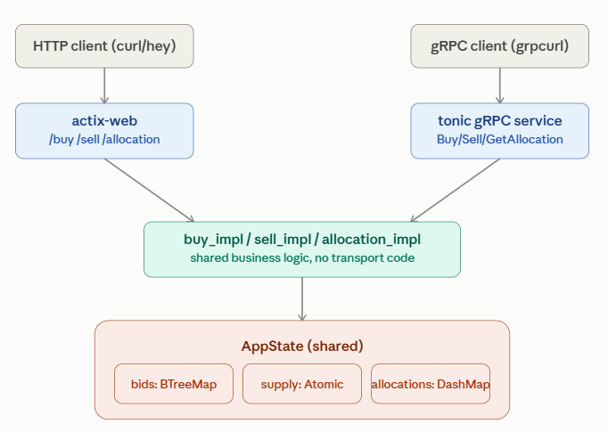

# When/Why gRPC

REST:    
External/public clients (browsers, mobile apps, third-party integrators) hit the REST/HTTP API since it's simpler to consume and debug.

gRPC:  
Internal services within our own infrastructure (e.g. a settlement service, a risk-check service, an analytics pipeline) would call twn over gRPC since it's faster and gives strict typed contracts between services you control.

# Adding gRPC Layer

Adding a gRPC layer as a second interface reusing the same `buy_impl`/`sell_impl` business logic:  

<p align="center">> image <<": ></p>

## Cheatsheet:


```sh
cargo r --bin twn
```

```
grpcurl -plaintext -d '{"volume":250}' localhost:50051 twn.twn/Sell
```
```
grpcurl -plaintext -d '{"user":"u1","volume":100,"price":3}' localhost:50051 twn.twn/Buy
```
```sh
grpcurl -plaintext -d '{"username":"u1"}' localhost:50051 twn.twn/GetAllocation
```
```
    {
    "volume": "100"
    }
```
--- 

Reflection:  
```
grpcurl -plaintext localhost:50051 list
```
```
    grpc.reflection.v1.ServerReflection
    twn.Twn
```

```
grpcurl -plaintext localhost:50051 list twn.Twn
```
```
    twn.Twn.Buy
    twn.Twn.GetAllocation
    twn.Twn.Sell
```


# Implementation:  

1. **Add `tonic` + `prost`** (Rust's standard gRPC stack) as dependencies, plus `tonic-build` in `build.rs` to compile `.proto` files.
2. **Write a `.proto` file** defining `Buy`, `Sell`, `GetAllocation` RPCs with the same fields you already have (`user`, `volume`, `price`).
3. **Implement a gRPC service** that calls your existing `buy_impl`/`sell_impl`/`allocation_impl` — no new business logic, just a new transport wrapping the same `AppState`.
4. **Run gRPC on a separate port** (e.g. 50051) alongside the existing actix-web HTTP server, both sharing the same `Arc<AppState>`.
5. **Test with `grpcurl`** (like you use `curl` today) or `tonic`'s generated client in a test.
6. **Benchmark it** with the same `hey`-style approach — write a small Rust or Go gRPC load-test client and compare P99/RPS against your existing HTTP numbers, since serialization/transport differences are exactly what you'd want to observe.

# Next Actions
- tw_grpc.rs: Add unit tests for buy/sell/get_allocation, integration test spinning up the gRPC server — existing REST code has unit/integration/concurrency/property test coverage; the new transport has none.
- src/tw_grpc.rs:52-58 — get_allocation returns 0 for an unknown username instead of an error, while REST /allocation returns 400 for a missing username. Undocumented divergence between the two APIs for the same query.
- src/tw_grpc.rs:40-49 — gRPC sell calls sell_impl directly with no volume == 0 validation, unlike the REST sell handler (tw_main.rs) which rejects volume == 0 with a structured 400. Same business rule, silently different behavior per transport.
- Use exact versions: `cargo add tonic@0.14.6 prost@0.14.4 tonic-reflection@0.14.6`