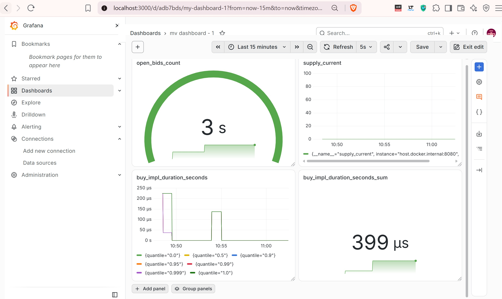
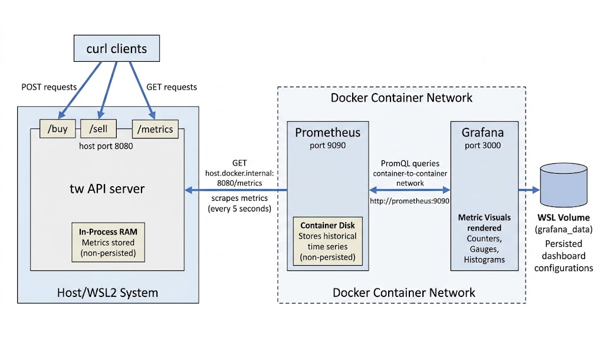
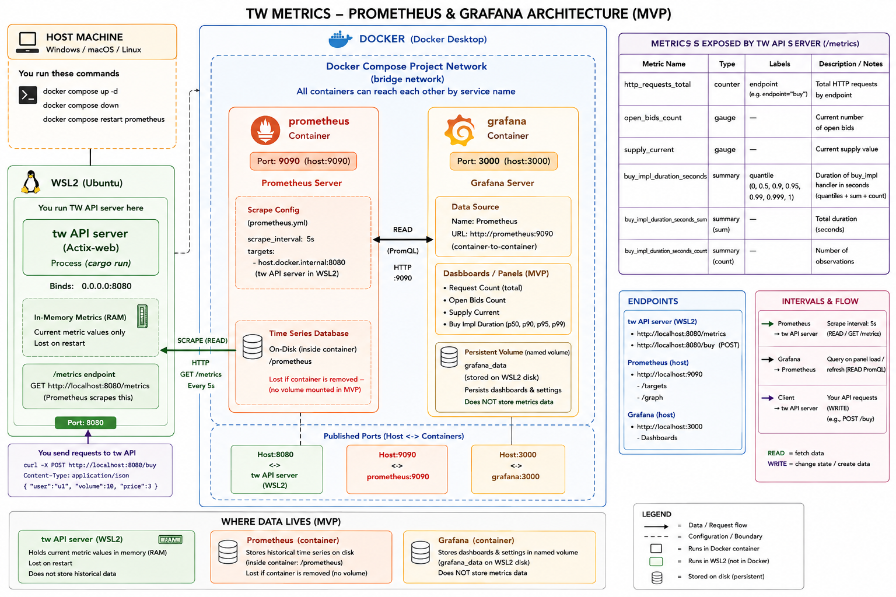

# Twn Metrics - Prometheus & Grafana

<p align="center">> image <<": ></p>


# Contents
- [Cheatsheet](#cheatsheet)
- [Architecture](#architecture)
- [Troubleshooting](#troubleshooting)
- [Understanding API server's Prometheus logs](#understanding-api-servers-prometheus-logs)
- [MVP Code Changes Summary](#mvp-code-changes-summary)


# Cheatsheet  

```
# 1. Using two cmds together: docker compose down and up: 
#    !! writable layer is destroyed; only named volumes 
#       and bind mounts survive.
#
# Fully tears down and rebuilds your Prometheus/Grafana setup 
# from scratch: stop + remove containers and network, then 
# recreate + start them fresh using the current config, which 
# is how you pick up changes to docker-compose.yml and 
# prometheus.yml

docker compose down  
  # stops and removes the containers and Docker network, 
  # but keeps named volumes.

docker compose up -d  
  # creates and starts the containers in the background, 
  # using the current `docker-compose.yml`.
  # -d (--detach) runs containers in the background


# 2. !! writable layer is preserved
docker compose restart prometheus
  # Restarts just the prometheus container (stop + start, 
  # same container instance) — quicker than down/up, doesn't 
  # touch other services or the network, and picks up 
  # prometheus.yml

```
[Back to top](#contents)


# Architecture


<p align="center">> image <<": ></p>


> More detailed view:

<p align="center">> image <<": ></p>


```
1. API server twn starts
   → binds 0.0.0.0:8080
   → in-memory metrics recorder initialized (empty)

2. curl POST /buy sent to twn (localhost:8080)
   → buy_impl runs, updates metrics:
       http_requests_total, buy_impl_duration_seconds,
       open_bids_count, supply_current
   → stored ONLY in twn's process memory
   → lost if twn restarts

3. Prometheus (container, port 9090) scrapes twn's metrics endpoint 
   → every 5s (scrape_interval in prometheus.yml)
   → GET http://host.docker.internal:8080/metrics
   → reads twn's current in-memory snapshot
   → appends a new sample to its own on-disk time series (inside
     the prometheus container's /prometheus data dir)
   → NOT persisted across container removal (no volume mounted
     for prometheus in current setup — only Grafana has one)

4. Grafana (container, port 3000) queries Prometheus
   → on panel load / "Run queries" / auto-refresh
   → sends PromQL query to http://prometheus:9090
     (container-to-container, via Docker's internal network —
      not via localhost, since both are in the same compose network)
   → Prometheus returns matching time-series points for the
     requested time range (e.g. "Last 15 minutes")
   → Grafana renders the panel; nothing is stored in Grafana itself
     except the dashboard/panel DEFINITIONS (queries, layout),
     which DO persist in grafana_data volume (WSL2 disk)

Summary of where data lives:
┌─────────────┬────────────────────────────┬───────────────────────┐
│ Component    │ What it stores             │ Persistence           │
├─────────────┼────────────────────────────┼───────────────────────┤
│ twn         │ current metric values only │ lost on restart       │
│ (port 8080)  │ (counters/gauges/summary)  │ (in-process RAM)      │
├─────────────┼────────────────────────────┼───────────────────────┤
│ Prometheus   │ full historical time series │ lost on container     │
│ (port 9090)  │ (every 5s sample)           │ removal (no volume)   │
├─────────────┼────────────────────────────┼───────────────────────┤
│ Grafana      │ dashboard/panel configs     │ persists via          │
│ (port 3000)  │ (NOT metric data itself)    │ grafana_data volume   │
└─────────────┴────────────────────────────┴───────────────────────┘

Key intervals:
- Prometheus scrape_interval: 5s  (twn polled this often)
- Grafana panel refresh: manual, or auto-refresh if set (e.g. 5s)
- Grafana query min interval: auto-calculated (or set via "Min interval")
```

[Back to top](#contents)


# Troubleshooting

Check API server is running: 

```bash
curl -s http://localhost:8080/metrics | grep open_bids_count
```

Check Prometheus is scraping successfully:  
```bash
curl -s http://localhost:9090/api/v1/targets | grep -A2 health
```

Trigger a fresh sample:  
```bash
curl -s -X POST http://localhost:8080/buy -H "Content-Type: application/json" -d '{"user":"u1","volume":10,"price":3}'
```

Narrow the time range in Grafana:     
To **"Last 15 minutes"** (instead of 6 hours) and click **Run queries** again — if twn was restarted recently, older 6-hour-old data simply doesn't exist to show.  

[Back to top](#contents)


# Understanding API server's Prometheus logs 

Actix-web's Logger middleware logging every HTTP request twn receives — here, Prometheus scraping /metrics every 5 seconds as configured.

```log
     Running `target/debug/twn`

-- Server starting on localhost:8080 ...
...
[2026-08-24T13:53:06Z INFO  actix_web::middleware::logger] 172.18.0.2 "GET /metrics HTTP/1.1" 200 0 "-" "Prometheus/3.14.0" 0.001412

[2026-08-24T13:53:11Z INFO  actix_web::middleware::logger] 172.18.0.2 "GET /metrics HTTP/1.1" 200 0 "-" "Prometheus/3.14.0" 0.000349

[2026-08-24T13:53:16Z INFO  actix_web::middleware::logger] 172.18.0.2 "GET /metrics HTTP/1.1" 200 0 "-" "Prometheus/3.14.0" 0.000295
```

| Value | Meaning |
|---|---|
| `172.18.0.2` | client IP — the Prometheus container's address on the Docker bridge network |
| `"GET /metrics HTTP/1.1"` | request line: method, path, HTTP version |
| `200` | HTTP status code returned |
| `0` | response body size in bytes (shows `0` here — likely a logging quirk, since `/metrics` clearly returns content, or it's logged before body write completes) |
| `"-"` | `Referer` header (absent) |
| `"Prometheus/3.14.0"` | `User-Agent` header — identifies the client as Prometheus and version 3.14.0 |
| `0.001412` | total request duration in seconds (~1.4ms) |

[Back to top](#contents)


# MVP Code Changes Summary

## Add dependencies

```toml
# Cargo.toml
[dependencies]
metrics = "0.24.6"
metrics-exporter-prometheus = "0.18.3"
```

## Register metrics + exporter in `tw_main_fn.rs`

```rust
use metrics_exporter_prometheus::PrometheusBuilder;

#[actix_web::main]
async fn main() -> std::io::Result<()> {
    let prometheus_handle = PrometheusBuilder::new()
        .install_recorder()
        .expect("failed to install Prometheus recorder");

    let app_state = web::Data::new(AppState::default());

    HttpServer::new(move || {
        let handle = prometheus_handle.clone();
        App::new()
            .app_data(app_state.clone())
            .route("/metrics", web::get().to(move || {
                let handle = handle.clone();
                async move { handle.render() }
            }))
            .service(buy)
            .service(sell)
            .service(allocation)
    })
    .bind(("127.0.0.1", 8080))?
    .run()
    .await
}
```

## Instrument `buy_impl` / `sell_impl` in `tw_main.rs`

Add the same pattern (`sell_impl_duration_seconds`, `"endpoint" => "sell"`) to `sell_impl`.

```rust
use metrics::{counter, histogram};
use std::time::Instant;

pub fn buy_impl(...) {
    let start = Instant::now();

    // ... 

    // metrics
    histogram!("buy_impl_duration_seconds")
      .record(start.elapsed().as_secs_f64());

    counter!("http_requests_total", "endpoint" => "buy")
      .increment(1);
  
    gauge!("open_bids_count").set(bids.len() as f64);
    gauge!("supply_current").set(supply.load(Ordering::Relaxed) as f64);
}
```

### and here is the API server's metrics endpoint:

```
curl -s localhost:8080/metrics

# TYPE http_requests_total counter
http_requests_total{endpoint="buy"} 7

# TYPE open_bids_count gauge
open_bids_count 2

# TYPE supply_current gauge
supply_current 0

# TYPE buy_impl_duration_seconds summary
buy_impl_duration_seconds{quantile="0"} 0.000029509
buy_impl_duration_seconds{quantile="0.5"} 0.000029506498233648032
buy_impl_duration_seconds{quantile="0.9"} 0.000029506498233648032
buy_impl_duration_seconds{quantile="0.95"} 0.000029506498233648032
buy_impl_duration_seconds{quantile="0.99"} 0.000029506498233648032
buy_impl_duration_seconds{quantile="0.999"} 0.000029506498233648032
buy_impl_duration_seconds{quantile="1"} 0.000033494
buy_impl_duration_seconds_sum 0.0006554130000000001
buy_impl_duration_seconds_count 7
```

## `prometheus.yml` scrape config

Defines what Prometheus container should do: which targets to scrape and how often.

```yaml
# prometheus.yml
global:
  scrape_interval: 5s

scrape_configs:
  - job_name: 'twn'
    # "static": hardcoding the target list (vs. dynamic service discovery 
    # like Kubernetes/Consul, which auto-populates targets 
    static_configs:
      - targets: ['host.docker.internal:8080']
        # ↑ list — could have multiple, e.g. if you ran
        #   several API server instances for load balancing:
        # targets: ['host.docker.internal:8080', 'host.docker.internal:8081']
```

## Docker Compose for Prometheus + Grafana

Defines which containers to run (Prometheus, Grafana), their ports, volumes, and networking.

```yaml
# docker-compose.yml
services:
  prometheus:
    image: prom/prometheus
    volumes:
      # bind mount <WSL:container>. 
      # Changes to ./prometheus.yml are visible in container immediately
      - ./prometheus.yml:/etc/prometheus/prometheus.yml
    ports:
      - "9090:9090"
    # let prometheus container reach host (WSL2 twn) by hostname
    extra_hosts:
      - "host.docker.internal:host-gateway"

  grafana:
    image: grafana/grafana
    ports:
      - "3000:3000"
    volumes:
    # Save Grafana data e.g. dashboard, panel etc..
    # named volume
    # "grafana_data" is just a name — Docker creates & manages the actual
    # storage location for you instead of you specifying, hidden under:
    # /var/lib/docker/volumes/<project>_grafana_data/_data
      - grafana_data:/var/lib/grafana

# Declare grafana_data as a named volume for Docker to create and manage
volumes:
  grafana_data:
```

## Run API server and Prometheus + Grafana containers

```bash
cargo r --bin twn
docker compose up -d

# API server's metrics endpoint
curl -s localhost:8080/metrics | head -30
```

## Wire Grafana with Prometheus

```
1. Open Grafana in browser: http://localhost:3000 (admin/admin)
2. Add data source -> Prometheus -> URL: http://prometheus:9090
3. Create: New dashboard -> panels for:
   - open_bids_count e.g. visual "Gauge"
   - supply_current
   - histogram for buy_impl_duration_seconds
   - rate(http_requests_total[1m])            # RPS
and choose unit as "seconds":
  → Unit field -> Time units
  → Select exactly: "seconds (s)"  (NOT "microseconds or anything else"
    things work better when the data is in Seconds)
  → Apply
```

[Back to top](#contents)
