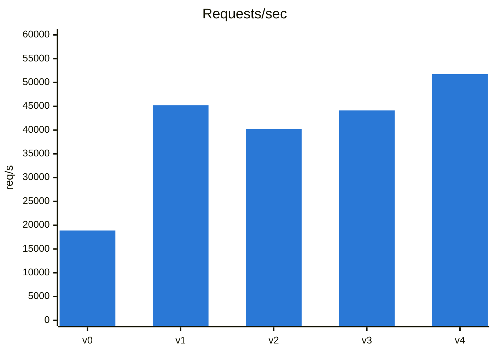
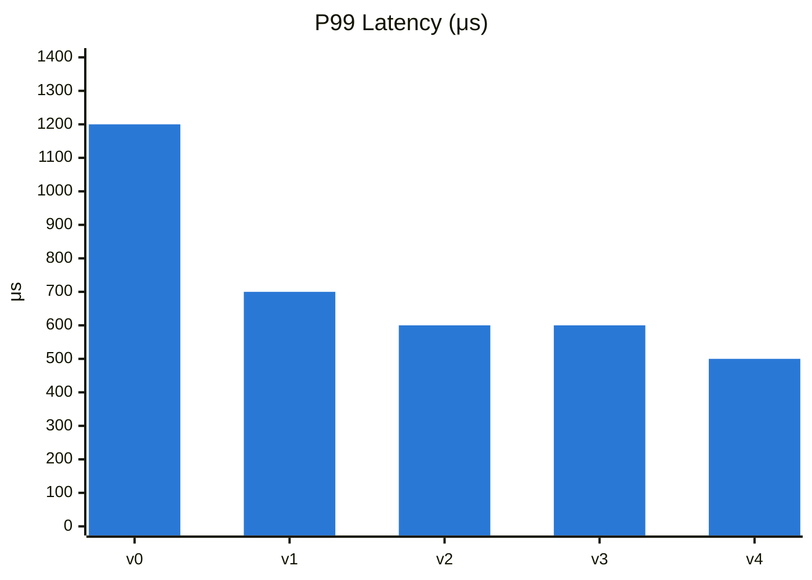

## Contents
[Goals](#goals)  
[Optimizations History](#optimizations-history)  
> [Throughput](#throughput)  
> [P99 Latency](#p99-latency)   

[Environment](#environment)  
[Next](#next)  
[Details](#details)  

==============================================

## Goals

- Maximize throughput 
- Minimize P99 latency 

under concurrent load while maintaining correctness guarantees.

## Optimizations History

Quick Cmds Reference:   
```
// Server   
RUSTC_WRAPPER="" cargo r --release --bin twin

// Client  
hey -c 10 -z 10s -m POST -d '{"user":"u1","volume":10,"price":3}' -H "Content-Type: application/json" http://localhost:8080/buy
```

[↑ Back to top](#contents)

### Throughput



### P99 Latency



[↑ Back to top](#contents)

// todo
- add p50

```

v4
  Requests/sec: 51780
  99% in 0.0005 secs
  Change: AppState.supply is now AtomicU64 instead of Mutex<u64> 
  commit: f84a350

v3
  Requests/sec: 44130
  99% in 0.0006 secs
  Change: Revert: Increase workers count from 2 to 8. 
          Workers count is 2 again.
          HttpServer::new(move || { App::new()}).workers(2) 
  commit: f84a350

v2
  Requests/sec: 40232
  99% in 0.0006 secs
  Change: Increase workers count from 2 to 8 
          HttpServer::new(move || { App::new()}).workers(8) 
  commit: f84a350

v1  
  Requests/sec: 45208
  99% in 0.0007 secs  
  Change: Removed Logger, unused Middleware fn and `dbg!()` line
          `dbg!(has_feature_new_alloc);`
  commit: f84a350

v0  
  Requests/sec: 18887  
  99% in 0.0012 secs  
  commit: a057663
```

[↑ Back to top](#contents)


## Environment

```
Surface Pro 7, 16 GB
$ lscpu | grep -E "Model name|CPU\(s\)"
CPU(s):                 8
On-line CPU(s) list:    0-7
Model name:             Intel(R) Core(TM) i7-1065G7 CPU @ 1.30GHz
NUMA node0 CPU(s):      0-7

$ uname -r
6.6.87.2-microsoft-standard-WSL2
```

[↑ Back to top](#contents)

## Next

- Replace `RwLock<BTreeMap>` on `bids` with a lock-free structure like `DashMap` or a channel-based design. DashMap uses a HashMap internally so we lose the sorted order that BTreeMap provides — we'd need to sort manually when processing bids. BTreeMap maintains sorted order automatically on every insert - O(log n), while DashMap is unsorted so we'd pay O(n log n) to sort at sell time instead.
- most popular profilers:  
 `perf` (Linux profiling), HotSpot (better) or `flamegraph`/`cargo-flamegraph`, `tokio-console` (async runtime), `valgrind`/`cachegrind`, `criterion` (benchmarking), `heaptrack`/`dhat` (memory), and `hyperfine` (CLI benchmarking).

- Put hey profiling cmds into script w/ 5 secs delay run 3 times. Calculate avarage p99, p50, throughput
- Items in section: [src\perf_perf_hotspot.md](perf_perf_hotspot.md) -> 5. Profiling Results
- buy handler costs ~80-400µs vs buy_impl's 1-5µs, confirming the overhead is JSON deserialization/HTTP parsing. Worth profiling HTTP/JSON layer specifically.

- claude could not fix it
```

this works: 
gok\@gsp7-1TB:/mnt/c/code$ 
perf annotate --symbol=actix_hello::tw_main::buy_impl

==========

but this not: 
perf annotate --symbol=actix_hello::tw_main::buy

                            ┌─Error:───────────────────────────┐
                            │The perf.data data has no samples!│
                            │                                  │
                            │                                  │
                            │Press any key...                  │
                            └──────────────────────────────────┘
```
- DashMap for bids (drop RwLock<BTreeMap>)
- pop_first early-exit instead of retain
- Box<str> / SmallVec for Bid/user
- Per-shard/sharded state instead of single global locks
- Batch/pipeline sell allocations
- Increase workers with sharded state (not global lock)
- Flamegraph/samply profiling pass
- Reduce allocations in hot path (avoid clone on user)
- Lock-free CAS for bids insert (like supply)
- HTTP keep-alive tuning
- Release build LTO + codegen-units=1
- jemalloc/mimalloc allocator swap

[↑ Back to top](#contents)

    
## Details

v0
```
hey -c 10 -z 10s -m POST -d '{"user":"u1","volume":10,"price":3}' -H "Content-Type: application/json" http://localhost:8080/buy

Summary:
  Total:        10.0052 secs
  Slowest:      0.0175 secs
  Fastest:      0.0001 secs
  Average:      0.0016 secs
  Requests/sec: 6148.1335

  Total data:   18811872 bytes
  Size/request: 305 bytes

Response time histogram:
  0.000 [1]     |
  0.002 [41407] |■■■■■■■■■■■■■■■■■■■■■■■■■■■■■■■■■■■■■■■■
  0.004 [15780] |■■■■■■■■■■■■■■■
  0.005 [3203]  |■■■
  0.007 [815]   |■
  0.009 [212]   |
  0.011 [59]    |
  0.012 [27]    |
  0.014 [4]     |
  0.016 [2]     |
  0.017 [3]     |


Latency distribution:
  10% in 0.0005 secs
  25% in 0.0008 secs
  50% in 0.0013 secs
  75% in 0.0021 secs
  90% in 0.0031 secs
  95% in 0.0040 secs
  99% in 0.0061 secs

Details (average, fastest, slowest):
  DNS+dialup:   0.0000 secs, 0.0001 secs, 0.0175 secs
  DNS-lookup:   0.0000 secs, 0.0000 secs, 0.0008 secs
  req write:    0.0000 secs, 0.0000 secs, 0.0076 secs
  resp wait:    0.0014 secs, 0.0000 secs, 0.0174 secs
  resp read:    0.0001 secs, 0.0000 secs, 0.0096 secs

Status code distribution:
  [200] 61513 responses
```

[↑ Back to top](#contents)
