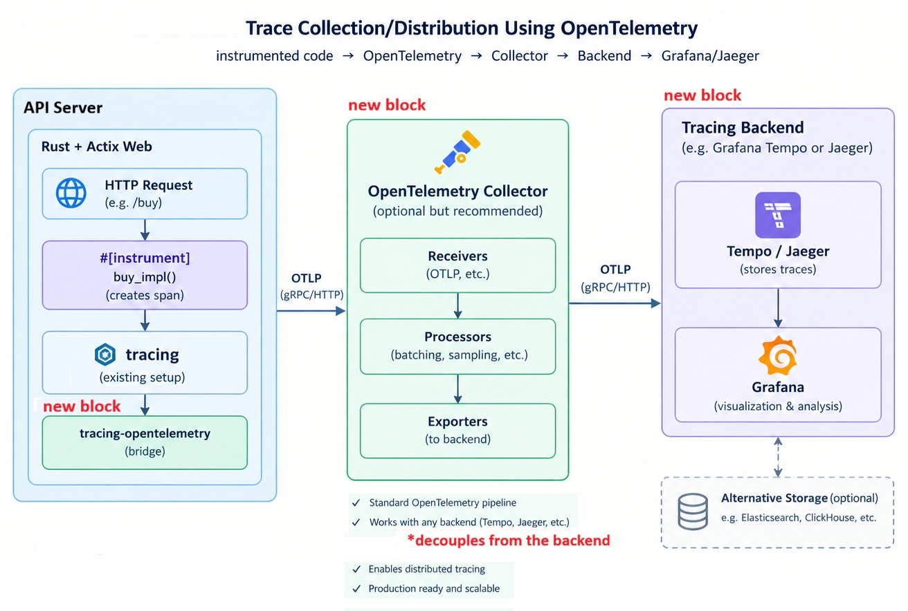
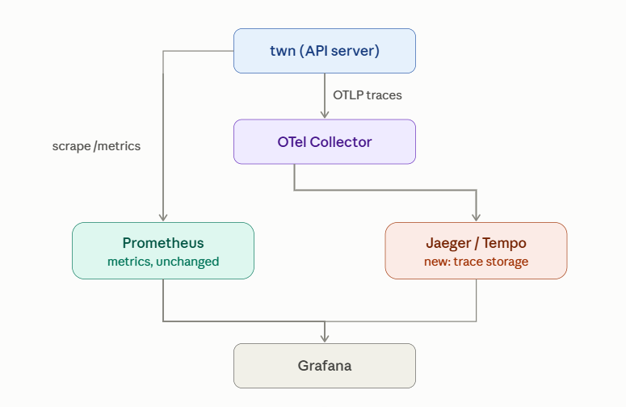
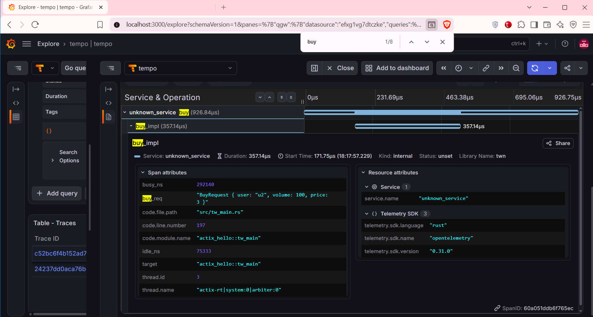

# Twn Tracing - OpenTelemetry & Tempo

# Contents
- [Architecture](#architecture)
- [Cheatsheet](#cheatsheet)
- [Traces](#traces)
- [MVP Code Changes Summary](#mvp-code-changes-summary)


# Architecture

<p align="center">> image <<": ></p>


- **`tracing-opentelemetry`** (in `twn`) — converts existing `tracing` spans (e.g. `#[instrument] fn buy`, `#[instrument] fn buy_impl`) into OTel's wire format and pushes them.

- **OTel Collector** — a receiver/buffer/router; it's not strictly required (could point `twn` straight at Jaeger's own OTLP endpoint), but it *decouples* `twn` from the backend (batching, retries, and swapping backends later without touching app code) and is the standard pattern once you have more than one service.
- **Tempo (or Jaeger)** — the actual storage + query engine for traces; Prometheus can't store spans (different data model — time series vs. trace trees), so need a dedicated backend.


### Tracing and Metrics - Pictured Together

<p align="center">> image <<": ></p>


[Back to top](#contents)


# Cheatsheet  

```
# 1. Using two cmds together: docker compose down and up: 
#    !! writable layer is destroyed; only named volumes 
#       and bind mounts survive.
#
# Fully tears down and rebuilds containers 
# from scratch: stop + remove containers and network, then 
# recreate + start them fresh using the current config, which 
# is how you pick up changes to docker-compose.yml, and container specific 
# yamls e.g. tempo.yml

docker compose down  
  # stops and removes the containers and Docker network, 
  # but keeps named volumes.

docker compose up -d  
  # creates and starts the containers in the background, 
  # using the current `docker-compose.yml`.
  # -d (--detach) runs containers in the background


# 2. !! writable layer is preserved
docker compose restart tempo
  # Restarts just the tempo container (stop + start, 
  # same container instance) — quicker than down/up, doesn't 
  # touch other services or the network, and picks up 
# tempo.yaml

```
[Back to top](#contents)


# Traces

```
Trace: a066... (one POST /buy request)
└── Span: buy               (926µs)
    └── Span: buy_impl      (357µs)
```

### Tempo View
<p align="center">> image <<": ></p>

### Log View

```sh
# buy_impl span

2026-09-06T15:17:57.230168Z  INFO buy{req_http=
HttpRequest HTTP/1.1 POST:/buy
  headers:
    "user-agent": "curl/7.81.0"
    "accept": "*/*"
    "content-type": "application/json"
    "host": "localhost:8080"
    "content-length": "36"
 req=Json(BuyRequest { user: "u2", volume: 100, price: 3 })}:buy_impl{buy_req=BuyRequest { user: "u2", volume: 100, price: 3 }}: actix_hello::tw_main: close time.busy=337µs time.idle=42.6µs

# buy span

2026-09-06T15:17:57.230551Z INFO buy{req_http=
HttpRequest HTTP/1.1 POST:/buy
  headers:
    "user-agent": "curl/7.81.0"
    "accept": "*/*"
    "content-type": "application/json"
    "host": "localhost:8080"
    "content-length": "36"
 req=Json(BuyRequest { user: "u2", volume: 100, price: 3 })}: actix_hello::tw_main: close time.busy=848µs time.idle=110µs
```

[Back to top](#contents)


# MVP Code Changes Summary


**1. `Cargo.toml`** — add:
```toml
opentelemetry = "0.31"
opentelemetry_sdk = { version = "0.31", features = ["rt-tokio"] }
opentelemetry-otlp = "0.31"
tracing-opentelemetry = "0.32"
```

**2. `tw_main_fn.rs`** — replace the tracing-subscriber init block (the `enable_tracing_spans` fmt block) with:
```rust
let exporter = SpanExporter::builder().with_tonic().build()
    .expect("failed to build OTLP exporter");
let provider = SdkTracerProvider::builder()
    .with_batch_exporter(exporter)
    .build();
let tracer = provider.tracer("twn");

// From the same spans, get both console output and OTLP export:
tracing_subscriber::registry()
    .with(tracing_subscriber::EnvFilter::from_default_env()
        .add_directive("info".parse().unwrap()))
    // - console output via tracing_subscriber::fmt::layer()
    .with(tracing_subscriber::fmt::layer()
        .with_span_events(tracing_subscriber::fmt::format::FmtSpan::CLOSE))
    // - and OTLP export via tracing_opentelemetry::layer() 
    .with(tracing_opentelemetry::layer().with_tracer(tracer))
    .init();
```

**3. `tw_main.rs`** — no changes; `#[instrument]` on `buy`/`buy_impl` works unmodified.

**4. `docker-compose.yml`** — add two services:
```yaml
# docker-compose.yml
services:
  prometheus:
  ...
  
  grafana:
  ...

  # observ-v2: Adding OpenTelemetry tracing
  otel-collector:
    image: otel/opentelemetry-collector-contrib:0.114.0
    volumes:
      - ./otel-collector-config.yaml:/etc/otelcol/config.yaml
    command: ["--config=/etc/otelcol/config.yaml"]
    ports:
      - "4317:4317" # OTLP gRPC

  tempo:
    image: grafana/tempo:2.7.0
    command: ["-config.file=/etc/tempo.yaml"]
    volumes:
      - ./tempo.yaml:/etc/tempo.yaml
    ports:
      - "3200:3200" # Tempo query API
...
```

**5. New `otel-collector-config.yaml`:**
```yaml
receivers:
  otlp:
    protocols:
      grpc:
        endpoint: 0.0.0.0:4317

# todo: Consider enabling batch. Currently, pipeline has no processors 
#       (e.g. batch), so every span exported to Tempo unbatched.
#       Especially for perf. reasons.
# 
# processors:
#  batch:

exporters:
  otlp/tempo:
    endpoint: tempo:4317
    tls:
      insecure: true # todo: not production-safe

service:
  pipelines:
    traces:
      receivers: [otlp]
      exporters: [otlp/tempo]
```

`prometheus.yml` and `docker-compose.yml`'s existing prometheus/grafana blocks stay untouched.


**6. Grafana** — add Tempo as a data source (`http://tempo:3200`) 

[Back to top](#contents)
